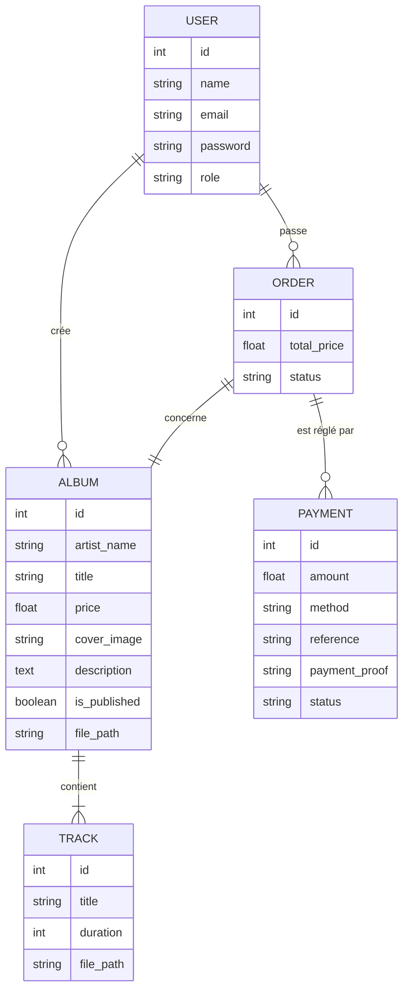

# Documentation Merise - Projet-Rap

Cette documentation présente l'Analyse Conceptuelle et Logique des données pour le projet **Projet-Rap**.

## 1. Modèle Conceptuel des Données (MCD)

Le MCD permet de représenter la structure des données du point de vue métier, sans contraintes techniques.

### Règles de Gestion
- Un **Utilisateur** peut créer plusieurs **Albums**. Un Album est créé par un seul Utilisateur (Admin).
- Un **Album** contient une ou plusieurs **Pistes (Tracks)**. Une Piste appartient à un seul Album.
- Un **Utilisateur** peut passer plusieurs **Commandes (Orders)**. Une Commande appartient à un seul Utilisateur.
- Une **Commande** concerne un seul **Album**. Un Album peut être présent dans plusieurs Commandes.
- Une **Commande** peut faire l'objet de plusieurs tentatives de **Paiement (Payments)**, mais une seule doit être approuvée. un Paiement concerne une seule Commande.

---

## 2. Modèle Logique des Données (MLD)

Le MLD est la traduction du MCD en une structure relationnelle (tables).

- **USER** (<u>id</u>, name, email, password, role, created_at, updated_at)
- **ALBUM** (<u>id</u>, artist_name, title, price, cover_image, description, is_published, file_path, *user_id*, created_at, updated_at)
    - *user_id* : clé étrangère vers USER(id)
- **TRACK** (<u>id</u>, title, duration, file_path, *album_id*, created_at, updated_at)
    - *album_id* : clé étrangère vers ALBUM(id)
- **ORDER** (<u>id</u>, total_price, status, *user_id*, *album_id*, created_at, updated_at)
    - *user_id* : clé étrangère vers USER(id)
    - *album_id* : clé étrangère vers ALBUM(id)
- **PAYMENT** (<u>id</u>, amount, method, reference, payment_proof, status, *order_id*, created_at, updated_at)
    - *order_id* : clé étrangère vers ORDER(id)
